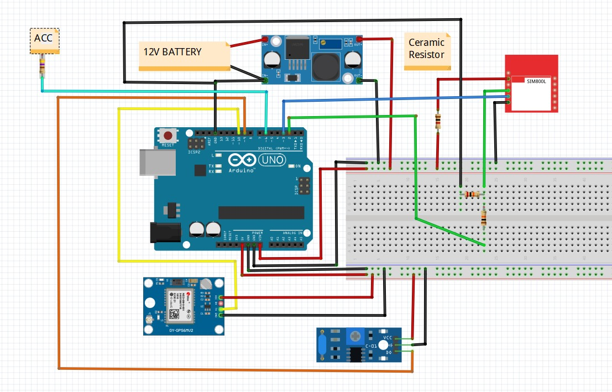
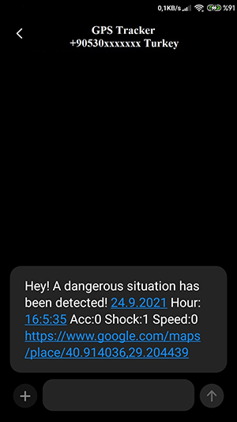

# Location Reporting Device

-ENG- 

With this project I prepared with Arduino, it is possible to ensure the security of your car or motorcycle against vehicle theft.

-TR-
 
Arduino ile hazırladığım bu proje ile taşıt hırsızlıklarına karşı otomobilinizin ya da motorsikletinizin güvenliğini sağlamanız mümkün.

## Materials Needed

1x Arduino Uno

1x Sim800l Module

1x GY-NEO6MV2 GPS Module

1x Grove SW 420 Knock Sensor

1x 1 Kohm Ceramic Resistor (High Watt)

1x 10 Kohm Resistor

1x 20 Kohm Resistor

1x 470 Ohm Resistor

1x Breadboard

1x LM2596 Regulator Board

x Jumpers

Attention! For the safety of the circuit and your vehicle, please do not forget to connect a "fuse" to the circuit.

Dikkat! Devrenin ve aracınızın güvenliği için devreye bir "sigorta" bağlamayı unutmayınız.

## Circuit Diagram

## Details About Usage

-ENG-

After completing the project setup..

-Before uploading the code, do not forget to change the phone number in the function named "Send_Data" in the code content according to you.

-Be sure to use a regulator due to voltage fluctuations in the vehicles.

-When the key is not inserted, location information will be sent to you as an sms for vibrations above a certain sensitivity.

-Sms will not be sent in low vibrations, such as cat shakes.

-If the high vibration continues, a new location will be sent for you to follow after a certain period of time.

-A notification message will be sent when the ignition is turned on. After this minute, sms has been deactivated, assuming that you are using the tool. No message will be sent on any vibration after the key is inserted.

-Messages sent will be as follows;

Attention: The sim8000L is not put into sleep mode in this project. Please put the sim8000L into "sleep mode" with code "AT commands" according to your battery status and vehicle usage situation (those who do not know how, please contact me). Otherwise, your battery may be discharged.

Attention: This project only reports the position during vibration and when the ignition is turned on. It is not possible to get location information by sending sms.
Since 2 communication is not possible at the same time on Arduino Uno, it could not be followed by sms. In version updates, the "sms follow-up" feature will come with Arduino Leonardo or Mega.

Attention: After the ignition is turned on, no more sms will be sent. So this system is not functional in case you lose your key.

-TR- 

Proje kurulumunu tamamladıktan sonra..

-Kodu yüklemeden önce kod içeriğindeki "Send_Data" isimli fonksiyon içerisindeki telefon numarasını kendinize göre değiştirmeyi unutmayınız. 

-Araçlardaki Voltaj dalgalanmaları nedeniyle mutlaka regülatör kullanın.

-Anahtar takılı değilken belli bir hassasiyetin üzerindeki titreşimlerde size sms olarak konum bilgisi gönderilecek.

-Düşük titreşimlerde -kedi sarsıntıları gibi- Sms gönderilmeyecektir.

-Yüksek titreşim devam ediyorsa belli bir süre sonra takip edebilmeniz için yeni konum gönderilecektir.

-Kontak açıldığında bildirim mesajı gönderilecek. Bu dakikadan sonra aracı sizin kullandığınız düşünülerek sms deaktif edilmiştir. Anahtar takıldıktan sonra herhangi bir titreşimde mesaj gönderilmeyecek.

-Gönderilen mesajlar şu şekilde olacak;

Dikkat: Bu projede sim8000L uyku moduna alınmamıştır. Akü durumunuza ve aracı kullanım durumunuza göre lütfen koda "AT komutları" ile sim8000L'yi "uyku moduna" alınız (nasıl yapılacağını bilmeyenler lütfen benimle iletişim kursun). Aksi takdirde akünüz boşalabilir.

Dikkat: Bu proje sadece titreşim anlarında ve kontak açıldığında konum bildirimi yapar. Sms göndererek konum bilgisi almak mümkün değildir. 
Arduino Uno'da 2 haberleşme aynı anda mümkün olmadığından dolayı sms ile takip yapılamadı. Versiyon güncellemelerinde Arduino Leonardo ya da Mega ile "sms ile takip" özelliği gelecek.

Dikkat: Kontak açıldıktan sonra tekrar sms atılmayacaktır. Bu yüzden anahtarınızı kaybettiğiniz durumlar için bu sistem işlevsel değildir.